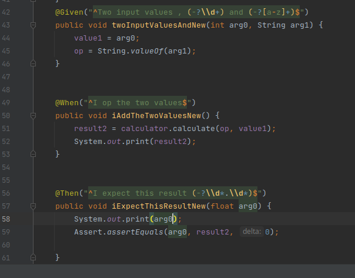

ابتدا موارد گفته شده را در پروژه پیاده‌سازی می‌کنیم.

### سوال ۲
دلیل این مسئله به خاطر وجود نداشتن عبارت ?- در تست شماره ۱ است. با برطرف کردن این مسئله، مشکل حل می‌شود. تصویر:

### سوال ۳

ابتدا در فایل فیچر، تست مربوطه را اضافه می‌کنیم. متن تست‌ها در حد اسپیس و this و چنین تغییرات جزئی تفاوت دارند:

حال در فایل MyStepdefs توابع جدید را پیاده می‌کنیم. نیاز به متغیرهای جدید داریم. از طرفی هندل کردن ریجکس‌ها در این مرحله بسیار مهم است. در این تکه کد من بیش از ۱۰ بار ریجکس را عوض کردم تا به نتیجه‌ی درست رسیدم:

در نهایت تست بدون مشکل پاس می‌شود:

